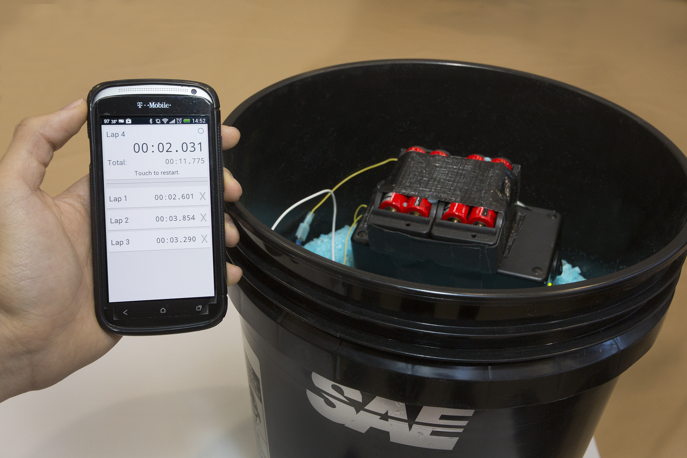

# Build18-Timer

A project I made in January 2014 during an engineer-oriented "hack week" for the Carnegie Mellon Racing team. This app interfaces with a photovoltaic sensor via IOIO board to detect when a beam of light is broken, thereby triggering the timer.

Unfortunately, it's been long enough since I wrote this app that I don't remember how to set it up again, but it should be as simple as installing it and connecting to a IOIO with a sensor on input 2. (according to https://github.com/tomzhang32/Build18-Timer/blob/master/Workspace/CMR%20Timer/src/com/carnegiemellonracing/racetimer/Timing.java#L117)

Here's a picture of the timer in use, beside the bucket of salt we used to store the PV sensor, IOIO, and batteries:

